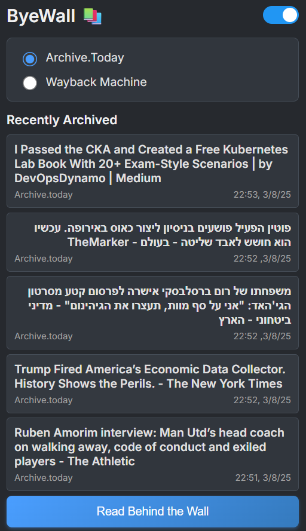

# ByeWall - Chrome Extension

📦 A browser extension that helps you bypass paywalls and access blocked content by instantly retrieving the latest archived versions of web pages from:
- [Archive.today](https://archive.today)
- [Wayback Machine](https://web.archive.org)

## ✅ Features

- One-click archive to selected services  
- Remembers your preferred archive service  
- Modern, minimal design 
- Keeps track of the last 5 archived pages you've accessed
- Cross-platform compatibility
- RTL language support - proper display for right-to-left languages
- Dark mode support - toggle between light and dark themes 

## 📸 Popup Interface Preview

## 🔧 How to Install

1. Download this repo  
2. Open Chrome and go to `chrome://extensions/`  
3. Enable **Developer mode**  
4. Click **Load unpacked**  
5. Select this folder  

## 🛠 Development Notes

- `popup.js` handles UI logic  
- `popup.html` - Clean, responsive interface with dark mode support
- No external dependencies  
- Simplified design - focused on reliability and ease of use  

### Special thanks to [@8288tom](https://github.com/8288tom) for improving the history functionality.

#### 🔒 Security Features
- URL validation and XSS protection
- Rate limiting to prevent service abuse  
- Secure external link handling

## 📄 License

MIT – free to use and modify.
