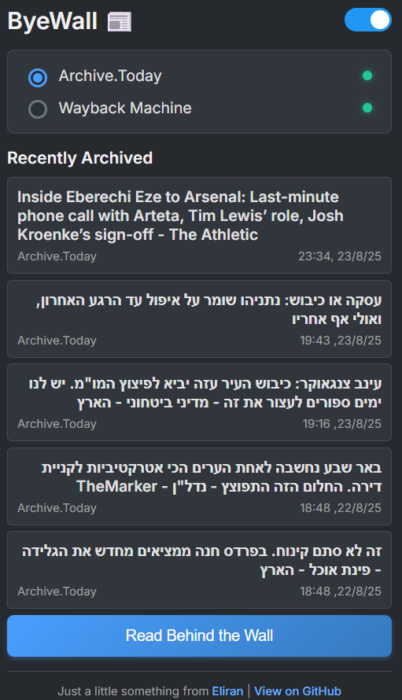

# ByeWall - Chrome Extension

📦 A browser extension that helps you bypass paywalls and access blocked content by instantly retrieving the latest archived versions of web pages from:
- [Archive.today](https://archive.today)
- [Wayback Machine](https://web.archive.org)

## ✅ Features

- One-click archive to selected services  
- Remembers your preferred archive service  
- Modern, minimal design 
- Keeps track of the last 5 archived pages you've accessed
- Cross-platform compatibility
- RTL language support - proper display for right-to-left languages
- Dark mode support - toggle between light and dark themes 
- **Smart fallback mechanism** - tries Archive.today even if pre-check times out
- **Reliable service status** — real-time health checks for Archive.today and Wayback Machine
- **Streamlined keyboard shortcuts**  

## 📸 Popup Interface Preview

## 🔧 How to Install

1. Download this repo  
2. Open Chrome and go to `chrome://extensions/`  
3. Enable **Developer mode**  
4. Click **Load unpacked**  
5. Select this folder  

## 🛠 Development Notes

- `popup.js` handles UI logic  
- `popup.html` - Clean, responsive interface with dark mode support
- No external dependencies  
- Simplified design - focused on reliability and ease of use  

### Special thanks to [@8288tom](https://github.com/8288tom) for improving the history functionality.

#### 🔒 Security Features
- URL validation and XSS protection
- Rate limiting to prevent service abuse  
- Secure external link handling

---

## ✨ Recent Improvements (v1.8.x)

- **Reliable service status**  
  Real-time health checks for Archive.today and Wayback Machine now go beyond just “online.”  
  They detect broken states (like blank pages), show clear green/red indicators with tooltips, and use a 5-minute cache to reduce API load while staying accurate.  

- **Streamlined keyboard shortcuts**  
  - `Ctrl+Shift+D` (`Cmd+Shift+D` on Mac): Open the extension  
  - `Ctrl+Shift+V` (`Cmd+Shift+D` on Mac): Instantly open the current page with your preferred service  

## ✨ Recent Improvements (v1.7.x)

- **Intelligent fallback**: If Archive.today pre-check fails/times out, the extension now tries to open the archive anyway instead of showing an error
- **No empty tabs**: background pre-check for Archive.today (1s timeout) shows an inline “No snapshot available” instead.  
- **Faster popup**: warm pre-check on open, smaller HTML sniff, 100ms click debounce.  
- **CSP-safe + instant dark mode**: early script moved to `popup-early.js`; no white flash; fonts load non-blocking.  
- **Cleaner history**: dedupes by normalized URL (drops UTM/hash, trims slashes); keeps only the latest visit per page (max 5).  
- **Clearer radios**: unchecked = gray ring, checked = blue dot (clearer in light mode).

## 🔍 How It Decides to Open a Tab

### Archive.today Flow (with Smart Fallback):
1. Background checks `archive.today/newest/<url>` with 1-second timeout
2. **If pre-check succeeds and snapshot exists** → opens the archive in a new tab  
3. **If pre-check fails (timeout/network error)** → tries opening the archive anyway (fallback mechanism)
4. **If pre-check succeeds but "No results" found** → shows message in popup (no tab opened)

This means Archive.today will almost always attempt to work, even when the pre-check service is temporarily slow or unavailable.

### Wayback Machine Flow:
- Unchanged - queries the API to confirm snapshot exists before opening

## 🚀 Why the Fallback Mechanism?

Archive.today's pre-check service can sometimes be slower than the actual archive service itself. Instead of frustrating users with "timeout" errors that require multiple clicks, the extension now intelligently falls back to trying the archive anyway. This provides a much smoother user experience while maintaining the speed benefits of the pre-check when it works.

## 🔐 Permissions

- `https://archive.today/*`, `https://archive.ph/*` – Archive.today pre-checks  
- `https://web.archive.org/*`, `https://archive.org/*` – Wayback lookups  
- `tabs`, `activeTab`, `storage` – open result tab, read current URL, store prefs/history

---

## 📄 License

MIT – free to use and modify.