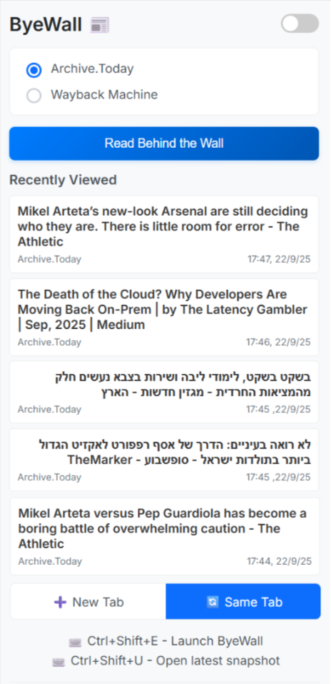
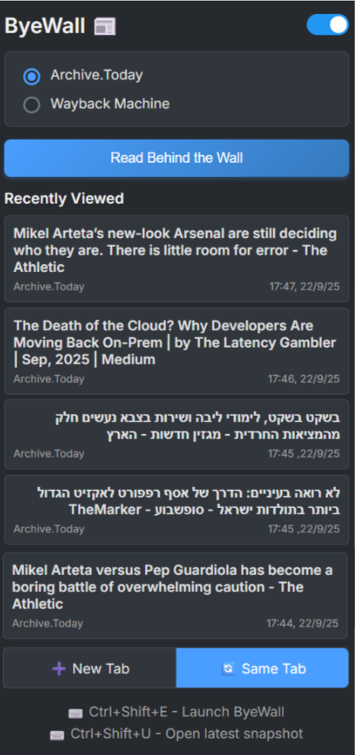

# ByeWall - Chrome Extension

📦 A browser extension that bypasses paywalls by instantly retrieving archived versions from [Archive.today](https://archive.today) and [Wayback Machine](https://web.archive.org).

## ✅ Features

- One-click access to archived pages
- Choose between Archive.today or Wayback Machine
- Track your last 5 archived pages
- Dark mode support
- Keyboard shortcuts: `Ctrl+Shift+E` (open popup), `Ctrl+Shift+U` (instant open of latest snapshot)
- Option of choosing whether open the archived snapshot on a new tab or in the same one

| Light Mode | Dark Mode |
|------------|-----------|
|  |  |

## 🔧 Installation

1. Download this repo
2. Go to `chrome://extensions/`
3. Enable **Developer mode**
4. Click **Load unpacked** and select this folder

## 🔐 Permissions

- Archive services: `archive.today`, `web.archive.org`
- Browser: `tabs`, `activeTab`, `storage`

## 📚 Documentation
- [Changelog](docs/CHANGELOG.md)
- [Technical Notes](docs/TECHNICAL.md)

---

**License:** MIT | **Thanks:** [@8288tom](https://github.com/8288tom) for history improvements